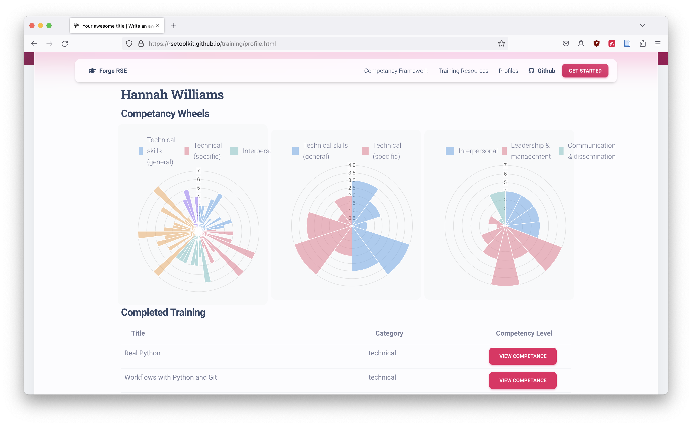

# DIgital REsearch CompeTencies (DIRECT) Project

## About

This project aims to define a skills and competencies framework to help classify and describe technical and non-technical skills used in the different digital Research Technical Professional (dRTP) roles. 

The project is divided into two technical sub-projects with distinct set of activities:

- **DIRECT skills and competencies framework**
   - [Browse skills and competencies](https://directframework.com/competencies)
   - [GitHub repository](https://github.com/direct-framework/digital-research-competencies-framework)
- **DIRECT Web Application** - Django webapp to enable practical use of the framework, browsing the skills and competencies, self-assessment and creation of individual skill profiles as “competency wheels”, comparing profiles across a team, defining template skills for different dRTP roles, etc..
   - [Website](https://directframework.com)
   - [GitHub repository](https://github.com/direct-framework/direct-webapp)

## Code of Conduct

See our [Code of Conduct](../CODE_OF_CONDUCT.md).

## History

DIRECT project and its repositories were created from the work that originally happened at the Software Sustainability Institute's [Collaborations Workshop 2023](https://www.software.ac.uk/workshop/collaborations-workshop-2023-cw23-0) Hack Day.

The idea was to construct a resource on technical skills that is for the RSE community and curated by the RSE community, along with training materials that can help people gain a particular skill, and visualise people's individual skill profiles as "competency wheels".

The project was added to the [RSE Competencies Toolkit organisation](https://github.com/RSEToolkit/) and as a resource to support RSEs (Research Software Engineers) in tracking and managing their professional development. We have now extracted the work into its own separate [GitHub organisation](https://github.com/direct-framework).

Note that, while we've focussed on RSEs during the early stages of development, this tool could be used for any roles that used digital skills for research (and we have now expanded the framework to reflect that). 

The project comprised:

1. An RSE competency framework, outlining a structured **set of skills** that are useful when working as an RSE, with
   examples of how these skills can be demonstrated at different **levels of experience**. Not all RSEs will or need to have
   all skills at all levels.
2. A curated set of training resources, linked to the skills and levels from the competency framework.
3. A tool to visualise and compare different competency profiles.

The project aimed to support the following uses:

1. Recording and visualising your competency profile as an individual RSE.
2. Comparing competency profiles across a group of RSEs (e.g. to show the commonalities and variety across RSEs doing
   the same role at the same level at the same organisation, or comparing across organisations).
3. Find high-quality training resources to improve skills in a particular competency.
4. Define aspirational competency profiles, illustrate the gap to your current profile and highlight training resources
   that could help bridge that gap.

The project won the 3rd prize at CW23 and we have carried on with the work on this project after the initial prototype. Since then, we have compared our 
work with many [related skill frameworks](#related-skills-&-competencies-frameworks) to make sure they are aligned and skills are not missed.

We have also consulted the wider RSE community at RSECon24 about the skills they use, where loads of non-technical/professional skills emerged. 

We have now expanded the remit of the framework to include non-technical as well as technical skills that are used in a wide variety of 
digital professional roles (and not just RSEs) such as researchers, data specialists (stewards, archivists, etc.), RSE group leads, PIs, etc.

## Governance

- [Governance model](../GOVERNANCE.md)
- [Current governance membership](../GOVERNANCE.md#current-governance-membership)
- [Meeting schedule](../GOVERNANCE.md#meetings)

## Licence

Unless otherwise specified, all material and content in this and the related project repositories is licensed as follows:

- Code is licenced under the [3-clause BSD licence](https://opensource.org/license/bsd-3-clause/).
- Documentation, data and other written material is licensed under the [Creative Commons Attribution licence](https://creativecommons.org/licenses/by/4.0/) (CC-BY 4.0).

## Documents

### Current working documents

* [Internal Google drive folder](https://drive.google.com/drive/u/0/folders/15pzFo9Vmf1C-PsBfiPyC3ZQBCGB92ssC) with various documents, presentations, etc.

### Documents no longer updated

- Collaborations Workshop 23 Hack Day
   * [CW23 Hack day report](https://docs.google.com/document/d/1ApTf8RcB86-RXrCJfCUMWDt6kRWSM0wVzBsPMCyhC8g)
   * [CW23 Hack day presentation](https://docs.google.com/presentation/d/15RBtaJ4W5bUWV7aHrwV0wX7op7hewl3B-w7vj6wieHg/edit#slide=id.g1e2424db41c_2_0)
   * [CW23 working HackMD document](https://hackmd.io/LwyTCm2LRwahi7yP8M7Brg?both)

## Contributors

See [current and past project contributors](../CONTRIBUTORS.md).

## Contributing

Anyone is welcome to contribute suggestions, feedback, and/or PRs to address any open issues in the relevant repository. 
You can also open a new issue if your idea is not yet mentioned anywhere else.
All contributors agree to abide by our [Code of Conduct](../CODE_OF_CONDUCT.md).

## Contact

If you'd like to get in touch with the project team - email us at direct-framework@googlegroups.com.

We also use #direct-framework channel under the RSE Community Slack (ukrse.slack.com).

## Acknowledgements

The initial version of this project was created during the Software Sustainability Institute Collaborations Workshop
2023 (CW23) Hack Day. Subsequent development was guided by a number of unconference sessions and contributions by RSE and dRTP community members during RSECon23, RSECon24 and CW25 and various other community engagement events and workshops.
